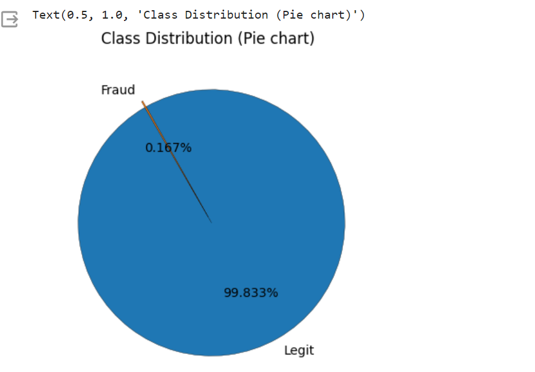
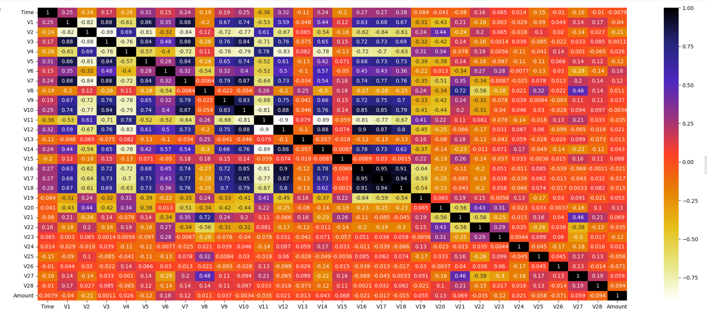

# CREDIT CARD FRAUD DETECTION

Tried to develop a credit card fraud detection system that can distinguish between legitimate and fraudulent transactions.

Steps involved in the project :

    1. Understanding the data
    2. EDA and Feature Selection
    3. Handling Imbalanced dataset 
    4. Model Building and Evaluation

You can find the dataset from below link :  
[_credit_card_dataset_](https://www.kaggle.com/datasets/mlg-ulb/creditcardfraud)

## Understanding of data
The dataset contains transactions made by the credit card users.

    1. It contains only numerical input variables which are the result of a PCA transformation.Features V1, V2, … V28 are the principal components obtained with PCA .
    2. Time and Amount are the only features that are not transformed by PCA.
  
Then checked for both null and duplicate values, and found no null values are present. But there are 1000 duplicate values, which were deleted from the dataset in order to overcome the disadvantage of overfitting if handeled not properly.

## Exploratory Data Analysis

Did exploratory data analysis to gain some insights on data:

**Class distribution**: plotted pie plot to show that data is highly Imbalanced.

Then calculated the time elapsed over the total transactions of the dataset, and found out to be 2 days.

Plotted the correlation heatmap to know any columns are highly correlated. Found out that there are around 11 columns which are having pearson's correation index minimum of 0.80. Then deleted all of them and leave only one from those highly correlated columns.

Also, handled Imbalanced dataset using Under-Sampling technique to address the issue of Biased Model & Overfitting.

## Model Building and Evaluation:

Checked for any outliers present in each of the columns and found out that there are significant number of outliers in most of the columns, so we can use Robustscaler for feature Scaling before the model training.

 * Created a pipeline consisting of data preprocessing step using Robustscaler and model chained together in a sequence.
 * Models used are LogisticRegression, Support Vector Machines and Random Forest Classifier
 * Evaluated different metrics like Accuracy, Precision, Recall & F1 score.

_Accuracy_ :

Measures the overall correctness of the model by calculating the ratio of correctly predicted instances to the total instances.

     (True Positives + True Negatives) / Total Predictions

_Precision_ :

Measures the accuracy of the positive predictions. It is the ratio of correctly predicted positive observations to the total predicted positives.

     True Positives / (True Positives + False Positives)

_Recall (Sensitivity or True Positive Rate)_ :

Measures the ability of the model to capture all the relevant cases. It is the ratio of correctly predicted positive observations to the all observations in actual class.

      True Positives / (True Positives + False Negatives)

_F1 Score_ :

Represents a balance between precision and recall. It is the harmonic mean of precision and recall, providing a single score that considers both false positives and false negatives.

       2 * (Precision * Recall) / (Precision + Recall)

 * cross-validation of these scores provides a more robust estimate of the model's performance.
 * RFC performs better  with an average scores of : __Accuracy__: _0.9366_, __Precision__: _0.9637_, __Recall score__: _0.9096_, __F1 score__: _0.9336_
 * LogisticRegression performed with an average scores of : __Accuracy__: _0.9293_, __Precision__: _0.9678_, __Recall score__: _0.8968_, __F1 score__: _0.9286_ 
 * Support Vector Machine performed with an average scores of : __Accuracy__: _0.9197_, __Precision__: _0.9681_, __Recall score__: _0.8691_, __F1 score__: _0.9129_ 
